<!--
/*
 * Copyright (c) 2026, DMMScape
 * All rights reserved.
 *
 * Redistribution and use in source and binary forms, with or without
 * modification, are permitted provided that the following conditions are met:
 *
 * 1. Redistributions of source code must retain the above copyright notice, this
 *    list of conditions and the following disclaimer.
 * 2. Redistributions in binary form must reproduce the above copyright notice,
 *    this list of conditions and the following disclaimer in the documentation
 *    and/or other materials provided with the distribution.
 *
 * THIS SOFTWARE IS PROVIDED BY THE COPYRIGHT HOLDERS AND CONTRIBUTORS "AS IS" AND
 * ANY EXPRESS OR IMPLIED WARRANTIES, INCLUDING, BUT NOT LIMITED TO, THE IMPLIED
 * WARRANTIES OF MERCHANTABILITY AND FITNESS FOR A PARTICULAR PURPOSE ARE
 * DISCLAIMED. IN NO EVENT SHALL THE COPYRIGHT OWNER OR CONTRIBUTORS BE LIABLE FOR
 * ANY DIRECT, INDIRECT, INCIDENTAL, SPECIAL, EXEMPLARY, OR CONSEQUENTIAL DAMAGES
 * (INCLUDING, BUT NOT LIMITED TO, PROCUREMENT OF SUBSTITUTE GOODS OR SERVICES;
 * LOSS OF USE, DATA, OR PROFITS; OR BUSINESS INTERRUPTION) HOWEVER CAUSED AND
 * ON ANY THEORY OF LIABILITY, WHETHER IN CONTRACT, STRICT LIABILITY, OR TORT
 * (INCLUDING NEGLIGENCE OR OTHERWISE) ARISING IN ANY WAY OUT OF THE USE OF THIS
 * SOFTWARE, EVEN IF ADVISED OF THE POSSIBILITY OF SUCH DAMAGE.
 */
-->

# DMMScape RuneLite Plugin Architecture

## Scope and goals

This document describes the DMMScape RuneLite plugin architecture in depth. It focuses on plugin runtime behavior, data flows, state management, UI/overlay structure, and development constraints.

Non-goals:
- Full backend or webapp architecture. Those systems are referenced only where needed to explain plugin integration.
- User-facing setup steps (see `docs/DEVELOPER_GUIDE.md`).

## System constraints (hard requirements)

- RuneLite only loads built-in plugins from the `net.runelite.client.plugins.*` namespace. Sideloaded plugins do not receive EventBus lambda subscriptions reliably and are not supported for development.
- Game-state reads must happen on the RuneLite client thread (e.g., Quest APIs, varps, widgets).
- UI is Swing; updates must be marshaled to the EDT (`SwingUtilities.invokeLater`).
- Target updates are pull-based (polling), not push-based.

## Architecture at a glance

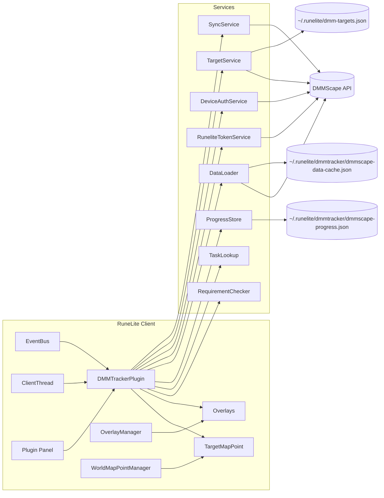

## Component inventory

| Component | Role | Key classes |
| --- | --- | --- |
| Plugin entry + orchestration | Event handling, state aggregation, sync/overlay wiring | `DMMTrackerPlugin` |
| Sync pipeline | Build payloads, send HTTP, track status | `SyncService`, `SyncData` |
| Target pipeline | Fetch/parse plan targets, manage focus | `TargetService`, `TargetPoint`, `TargetMapPoint` |
| Auth | Device code flow + access token storage | `DeviceAuthService` |
| Short-lived token | Request and refresh sync token | `RuneliteTokenService` |
| Local state store | Persist UI-related progress | `ProgressStore` |
| Data catalog | Load static/remote data for UI | `DataLoader` and `com.dmmtracker.data.*` |
| Mapping helpers | Map CA/diary tasks to IDs | `TaskLookup`, `CAIDMapper`, `BossNameMapper`, `DiaryNameUtils` |
| Requirement evaluation | Skill/quest requirement checks | `RequirementChecker` |
| UI | Tabbed panel + tabs and components | `ui/DMMTabbedPanel`, `ui/tabs/*`, `ui/components/*` |
| Overlays | Scene + minimap + world map routing | `DMMTargetOverlay`, `DMMMinimapOverlay`, `RouteOverlay`, `WorldMapRouteOverlay` |

Note: `DMMTrackerPanel` is a legacy single-panel implementation; the plugin currently uses `DMMTabbedPanel`.

## Data domains and sources

| Domain | Source(s) | Core logic | Notes |
| --- | --- | --- | --- |
| Combat Achievements | CA varps (20 varps, 640 bits) | `getAllCompletedCAs`, `checkCAChanges` | Dynamic name mapping via `initializeCANameMapping` + `TaskLookup` |
| Diaries (tier completion) | Varbits | `getAllDiaryProgress`, `checkDiaryChanges` | Per-task completion only available when journal is opened |
| Diary task counts | Varbits | `getAllDiaryTaskCounts`, `syncDiaryTaskUpdatesFromJournal` | Stored in `ProgressStore` |
| Quests | `Quest.getState()` | `getAllCompletedQuests` | Requires client thread |
| Quest points | Varp `VarPlayerID.QP` | `checkQuestPointChanges` | Triggers quest completion check |
| Skills | `StatChanged` events | `onStatChanged` | Delta-only, full sync on login |
| Boss KC | Chat messages | `handleBossKCUpdate` | Regex parsing with normalization via `BossNameMapper` |
| Clues | Chat messages | `handleClueCompletion` | Tier counts by regex |
| Collection log | Varp `VarPlayerID.COLLECTION_COUNT` | `checkCollectionLogChanges` | Total count only |
| Plan targets | API or local file | `TargetService.fetchTargets` | Polling, supports focus target |
| Owned unlocks | API sync response | `handleSyncResponse` | Stored in `ProgressStore` |

## Data loading pipeline

The data catalog (bosses, diaries, CAs, sigils, lamps, etc.) is loaded via `DataLoader` using a cache + bundled + remote update strategy.

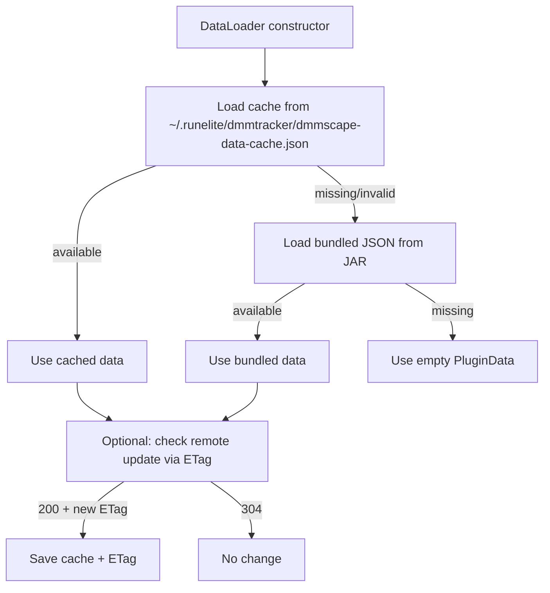

## Event handling map

| Event | Handler | Purpose |
| --- | --- | --- |
| `GameStateChanged` | `onGameStateChanged` | Schedule initial sync on login, reset state on logout |
| `VarbitChanged` | `onVarbitChanged` | CA/quest/collection/diary detection |
| `WidgetLoaded` | `onWidgetLoaded` | Parse diary task updates from journal |
| `StatChanged` | `onStatChanged` | Skill level delta sync |
| `ChatMessage` | `onChatMessage` | Boss KC and clue completion parsing |
| `PlayerSpawned/Despawned` | `onPlayerSpawned/onPlayerDespawned` | Player alarm tracking |
| `ConfigChanged` | `onConfigChanged` | Enable/disable overlays, reschedule polling, refresh auth |
| `GameTick` | `onGameTick` | Refresh panel + map markers, refresh auth token |

## Runtime flows

### Initial login sync (full state)

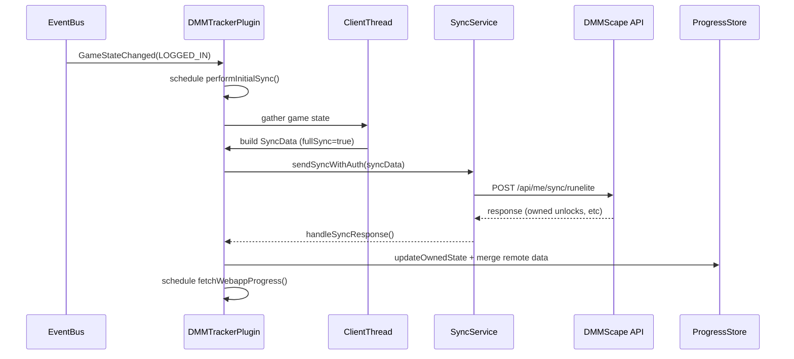

Key behaviors:
- Initial sync reads everything available from game state, not just deltas.
- CA name mapping is initialized once per session.
- Progress store is updated with owned unlocks and remote merges.
- Webapp progress import is optional and gated by `autoImportWebapp`.

### Delta sync (live updates)

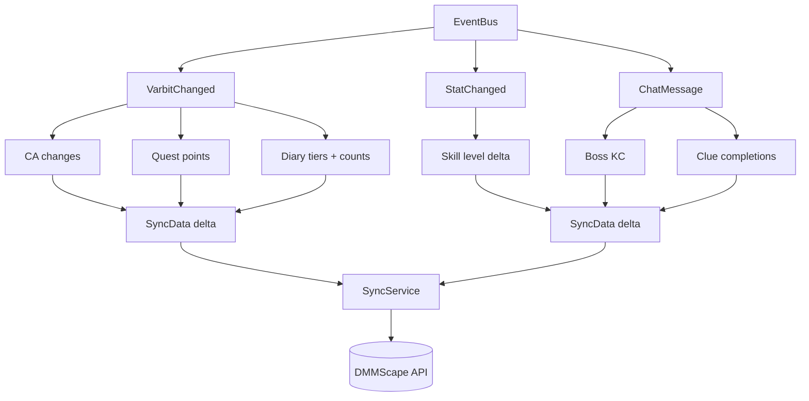

Delta detection uses cached state inside `DMMTrackerPlugin` (`lastBossKCs`, `lastSkillLevels`, etc) to avoid unnecessary payloads.

### Webapp progress import (optional)

- After initial sync, the plugin can fetch `/api/me/progress` to detect webapp-only progress (e.g., hiscores).
- Differences are shown to the user or auto-imported depending on `autoImportWebapp`.
- Merge strategy is conservative: the higher value wins for numeric stats.

### Target polling and overlays

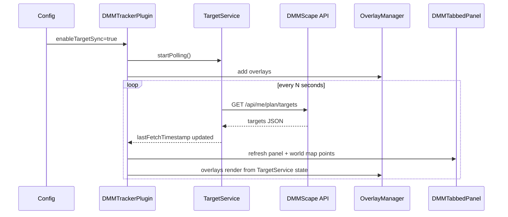

Notes:
- Targets can also be loaded from local file `~/.runelite/dmm-targets.json` for development/testing.
- A focus target can override normal plan targets for diary navigation.

### Target source selection (URL vs local file)

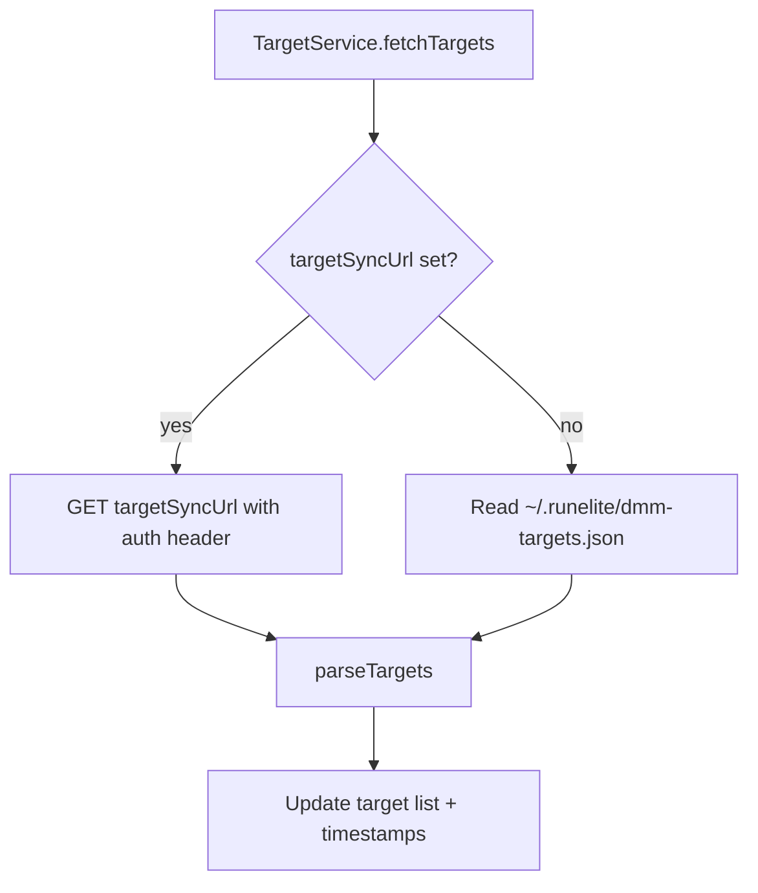

### Target completion updates

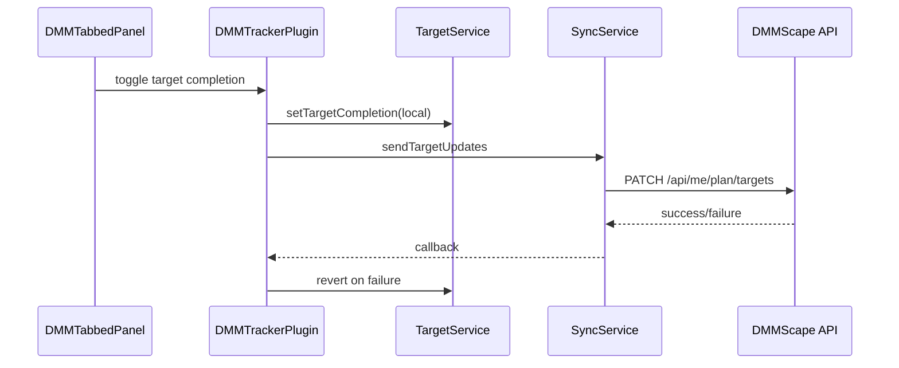

### Overlay rendering pipeline

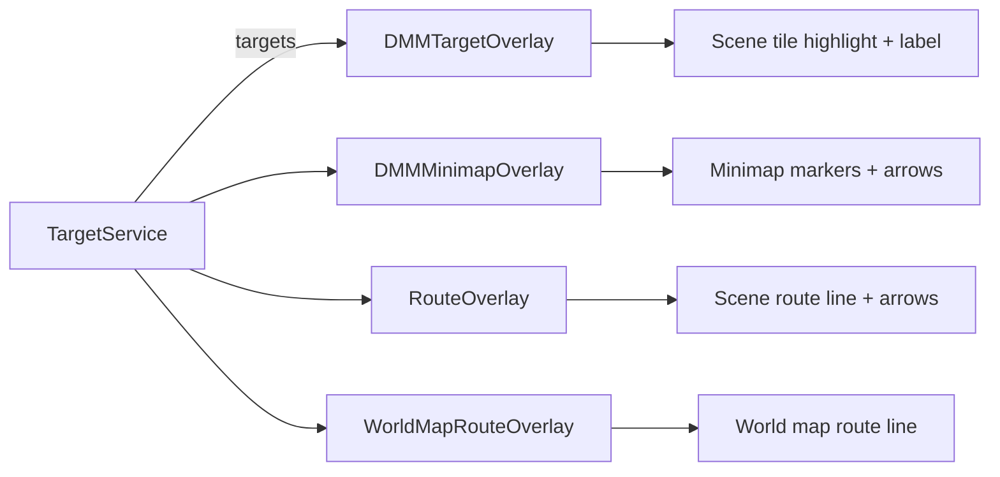

Overlays read `TargetService` state each render pass and respect config flags such as `showTargetOverlay`, `enableRouteDrawing`, and per-surface toggles.

## Threading model

- EventBus callbacks run on the client thread, but heavy work should be offloaded to `ScheduledExecutorService`.
- Game-state reads (quests, widgets, varps) must run on the client thread.
- Swing UI updates must run on the EDT (`SwingUtilities.invokeLater`).
- Network requests run in OkHttp worker threads.

## State and persistence

| State | Storage | Owner | Notes |
| --- | --- | --- | --- |
| Progress UI state | `~/.runelite/dmmtracker/dmmscape-progress.json` | `ProgressStore` | Completed tasks, owned unlocks, diary counts, boss KC |
| Data catalog cache | `~/.runelite/dmmtracker/dmmscape-data-cache.json` + ETag | `DataLoader` | Remote data snapshot and ETag |
| Target snapshot | `~/.runelite/dmm-targets.json` (optional) | `TargetService` | Only used when file sync is configured |
| Auth tokens | RuneLite config | `DeviceAuthService` | Access token + linked username |

## Auth and identity (summary)

- Primary flow: Device code linking in `DeviceAuthService`.
- Fallback: API key in config (`apiKey`).
- Short-lived sync token: `RuneliteTokenService` requests `/api/me/sync-token` and refreshes as needed.
- `DMMTrackerPlugin` stores the active auth header for sync + targets and updates `TargetService` when it changes.

### Auth header resolution and token refresh

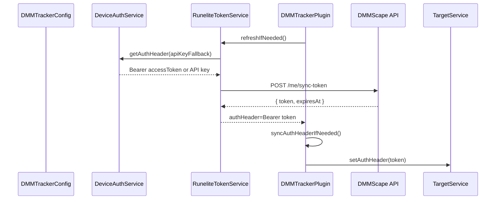

Notes:
- If device link is active, a Bearer access token is used to request a short-lived sync token.
- If not linked, the API key fallback is used for sync requests (via `X-Api-Key`).
- API base URL is derived from `webhookUrl` or `targetSyncUrl` when possible.

### Auth state machine

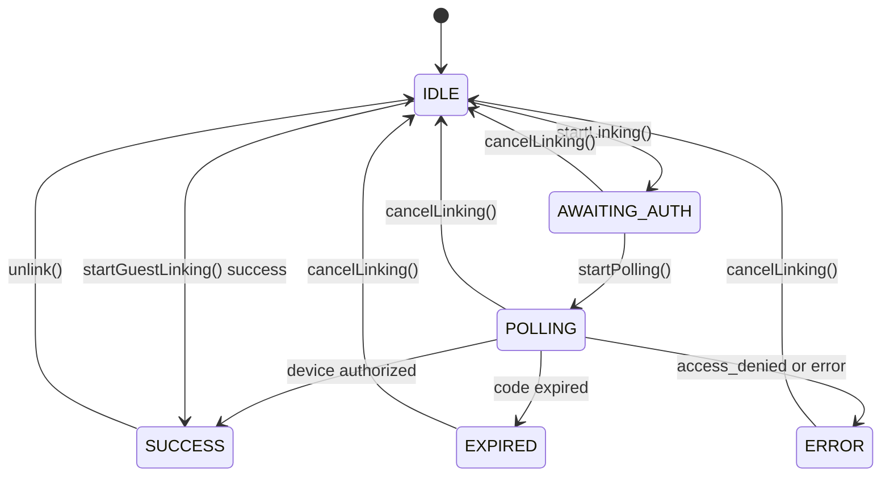

Notes:
- `startLinking()` requests a device code, opens the browser, then transitions to polling.
- `startGuestLinking()` bypasses browser auth and links a guest account.
- `cancelLinking()` clears the session and returns to `IDLE`.

## UI architecture

- `DMMTabbedPanel` is the main UI, hosting tabs: Plan, Bosses, Sigils/Lamps/Prayers, Diaries, Combat Achievements.
- Tabs are plain Swing panels backed by `DataLoader` and `ProgressStore`.
- Global Search is a separate view within the panel, not a RuneLite sidebar tab.
- Settings view uses `SettingsPanel` (config editor) and is navigated via header buttons.

### UI component tree

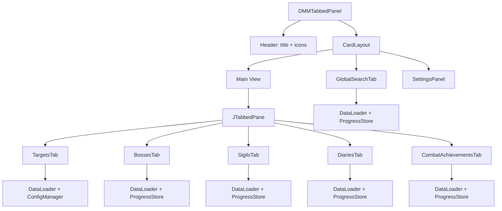

Notes:
- `DMMTrackerPlugin` wires event handlers (sync, target toggle, open web, link, guest) into `DMMTabbedPanel`.
- `DMMTrackerPanel` exists but is legacy and not used by the plugin entrypoint.

### Config change handling

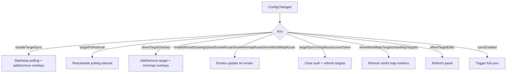

## Extension points

- New data type in sync:
  1) Add fields to `SyncData`.
  2) Capture deltas in `DMMTrackerPlugin` event handlers.
  3) Update UI and optionally `ProgressStore`.
- New target rendering behavior:
  1) Extend `TargetPoint` or add new overlay.
  2) Respect config toggles.
- New tab:
  1) Create `ui/tabs/*` panel.
  2) Wire into `DMMTabbedPanel`.

## Backend/webapp integration (gloss)

The plugin interacts with the DMMScape API for:
- Syncing progress (`/api/me/sync/runelite`)
- Fetching progress import data (`/api/me/progress`)
- Fetching plan targets (`/api/me/plan/targets`)
- Updating target completion (`/api/me/plan/targets`)
- Adding targets to plan (`/api/me/plan/targets`)
- Device auth and sync token flows (`/api/me/device/*`, `/api/me/sync-token`)

Refer to backend documentation for full schema and auth rules.

## Related decisions

Architecture decisions are recorded as ADRs:
- `docs/ADR/README.md`
