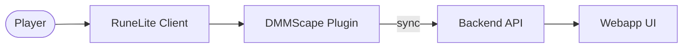

<!--
/*
 * Copyright (c) 2026, DMMScape
 * All rights reserved.
 *
 * Redistribution and use in source and binary forms, with or without
 * modification, are permitted provided that the following conditions are met:
 *
 * 1. Redistributions of source code must retain the above copyright notice, this
 *    list of conditions and the following disclaimer.
 * 2. Redistributions in binary form must reproduce the above copyright notice,
 *    this list of conditions and the following disclaimer in the documentation
 *    and/or other materials provided with the distribution.
 *
 * THIS SOFTWARE IS PROVIDED BY THE COPYRIGHT HOLDERS AND CONTRIBUTORS "AS IS" AND
 * ANY EXPRESS OR IMPLIED WARRANTIES, INCLUDING, BUT NOT LIMITED TO, THE IMPLIED
 * WARRANTIES OF MERCHANTABILITY AND FITNESS FOR A PARTICULAR PURPOSE ARE
 * DISCLAIMED. IN NO EVENT SHALL THE COPYRIGHT OWNER OR CONTRIBUTORS BE LIABLE FOR
 * ANY DIRECT, INDIRECT, INCIDENTAL, SPECIAL, EXEMPLARY, OR CONSEQUENTIAL DAMAGES
 * (INCLUDING, BUT NOT LIMITED TO, PROCUREMENT OF SUBSTITUTE GOODS OR SERVICES;
 * LOSS OF USE, DATA, OR PROFITS; OR BUSINESS INTERRUPTION) HOWEVER CAUSED AND
 * ON ANY THEORY OF LIABILITY, WHETHER IN CONTRACT, STRICT LIABILITY, OR TORT
 * (INCLUDING NEGLIGENCE OR OTHERWISE) ARISING IN ANY WAY OUT OF THE USE OF THIS
 * SOFTWARE, EVEN IF ADVISED OF THE POSSIBILITY OF SUCH DAMAGE.
 */
-->

# DMMScape RuneLite Plugin - Documentation

## Quick Overview

Start here if you are new to the plugin codebase:

- `docs/DEVELOPER_GUIDE.md` - setup, workflow, AGENTS summary, and troubleshooting
- `docs/ARCHITECTURE.md` - in-depth architecture with diagrams and data flows
- `docs/CONFIG_REFERENCE.md` - full config key reference and behavior notes
- `docs/DATA_CONTRACTS.md` - payload shapes for sync, targets, and imports
- `docs/DATA_FLOW_TRACE.md` - step-by-step data flow traces with entry points
- `docs/CODE_MAP.md` - file-level map for reviewers and contributors
- `docs/LIMITATIONS.md` - known constraints and gaps
- `docs/CREDITS.md` - third-party credits and attribution
- `docs/THIRD_PARTY_LICENSES.md` - third-party license texts
- `docs/SECURITY_PRIVACY.md` - data usage, storage, and security notes
- `docs/REVIEW_NOTES.md` - RuneLite review summary
- `docs/REVIEW_GUIDE.md` - reviewer quick path and code entry points
- `docs/QA_CHECKLIST.md` - manual test checklist
- `docs/ADR/README.md` - architecture decisions (ADRs)
- `docs/GLOSSARY.md` - shared terminology

Supporting docs:

- `docs/DEVELOPMENT-SETUP.md` - full macOS setup commands (authoritative workflow)
- `docs/code-conventions.md` - RuneLite formatting and style rules
- `docs/analysis-and-improvements.md` - current gaps and improvement roadmap
- `docs/webapp-parity-plan.md` - UI parity goals between webapp and plugin

Notes:

- Backend and webapp details are intentionally summarized here. See backend/webapp repos for full API specs and data contracts.
- If you find older docs that mention sideloading, treat them as deprecated. This plugin requires the built-in RuneLite plugin location for development.
